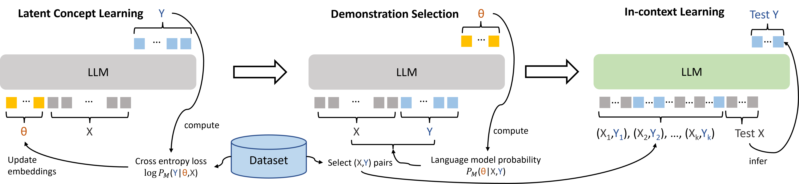

# Large Language Models Are Implicitly Topic Models: Explaining and Finding Good Demonstrations for In-Context Learning

This is the official repository of the paper [Large Language Models Are Implicitly Topic Models: Explaining and Finding Good Demonstrations for In-Context Learning](https://arxiv.org/abs/2301.11916).
A large portion of the code is based on the [MetaICL codebase](https://github.com/facebookresearch/MetaICL).



## Preparation

The code is tested with python 3.8.

Install the data dependencies and download the data.
```bash
conda create --name metaicl-data python=3.8
conda activate metaicl-data
pip install datasets==1.4.0 wget
cd preprocess
python run.py
```

After preprocesisng is done, come back to the main directory.
```bash
cd ../
conda deactivate
```

Now, install the model dependencies to run the model. Please note that the Transformer version is not compatible to the datasets library used to download the data, so make sure to use a different environment.
```
conda create --name metaicl python=3.8
conda activate metaicl
pip install torch==1.9.0
pip install git+https://github.com/huggingface/transformers.git@c37573806ab3526dd805c49cbe2489ad4d68a9d7
pip install sentence-transformers
```

(Optional) Install OpenAI Python Library for running GPT-3
```
pip install openai
```

## Latent concept learning

To obtain the "concept" tokens, please first run the script `tensorize.sh`, then run the script `train.sh`. We simutaniously train a set of datasets together and obtain separate concept tokens for each datasets. This set of datasets is called a `$TASK`. Currently, we define 3 tasks: glue, diverse and tune. You can see what datasets are contained in each task by inspecting the corresponding `.json` file in `./config`. The concept tokens of these 3 tasks will be stored in `./checkpoints`. We also provide some example concept token embeddings at [this Google drive folder](https://drive.google.com/drive/folders/15UeFnuJK1akAXLHPQ0IRwnf566ApxNwT?usp=share_link) to reproduce our results.

## Demonstration selection

To obtain performance on test set by using different way to choose the in-context examples, you can use `prior.sh`. `--prior easiest` means choosing the examples that can most likely infer the learned concept tokens.  `--prior most_similar` means choosing the examples that are most similar to the test input.  By commenting out the `--prior` line, examples will be chosen uniformly. More details of each argument can be found in `test.py`. In `variables`, we provide the value of bash script variables to reproduce our results.
